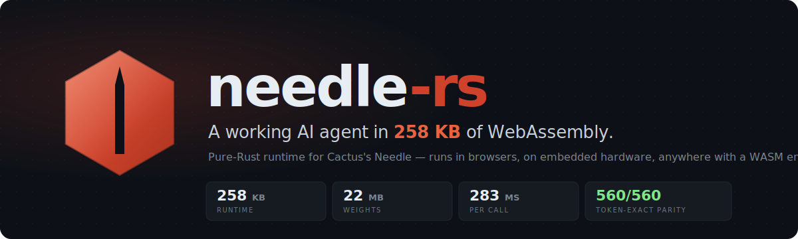

<div align="center">
  

  <br/><br/>

  <p>
    <a href="https://needle-rs.pages.dev"><b>→ Live demo</b></a>
  </p>

  <p>
    <a href="https://github.com/geekgineer/needle-rs/actions/workflows/ci.yml"></a>
    <a href="#parity"></a>
    <a href="https://crates.io/crates/needle-rs"></a>
    <a href="https://www.npmjs.com/package/needle-rs"></a>
    <a href="https://pypi.org/project/needle-rs/"></a>
    <a href="LICENSE"></a>
  </p>

  <p>
    <a href="#quick-start">Quick start</a> &nbsp;·&nbsp;
    <a href="#how-it-works">How it works</a> &nbsp;·&nbsp;
    <a href="#parity">Parity</a> &nbsp;·&nbsp;
    <a href="https://github.com/cactus-compute/needle">Upstream model</a>
  </p>
</div>

<br/>

A pure-Rust + WebAssembly runtime for [Needle](https://github.com/cactus-compute/needle) by [Cactus Compute](https://github.com/cactus-compute) — a 26M-parameter transformer that maps `(query, tool list) → JSON call` in one forward pass. Deploys to browsers, edge workers, CLIs, Python, and `no_std` embedded targets. No server, no API key.

<br/>

<!-- ────────────────────────────────────────────────── -->
<h2>
  
</h2>

Tool calling usually means either a paid API call or hundreds of megabytes on disk. `needle-rs` ships the whole agent in 23 MB.

<table>
<thead>
<tr>
<th align="left">Stack</th>
<th align="right">Deploy size</th>
<th align="right">Latency</th>
<th align="right">Cost</th>
<th align="center">Privacy</th>
</tr>
</thead>
<tbody>
<tr>
<td>OpenAI function calling</td>
<td align="right">SDK + hosted API</td>
<td align="right">300–800 ms</td>
<td align="right">$ per token</td>
<td align="center">leaves device</td>
</tr>
<tr>
<td>llama.cpp + 1B local model</td>
<td align="right">700 MB+</td>
<td align="right">varies</td>
<td align="right">free</td>
<td align="center">local</td>
</tr>
<tr>
<td>ONNX Runtime Web + a model</td>
<td align="right">8 MB + your model</td>
<td align="right">varies</td>
<td align="right">free</td>
<td align="center">local</td>
</tr>
<tr>
<td><b><code>needle-rs</code> + Needle</b></td>
<td align="right"><b>258 KB + 22 MB</b></td>
<td align="right"><b>~280 ms</b></td>
<td align="right"><b>free</b></td>
<td align="center"><b>local</b></td>
</tr>
</tbody>
</table>

Same answer to *"did the user ask for a flight booking?"* — at a fraction of the footprint.

<br/>

<!-- ────────────────────────────────────────────────── -->
<h2 id="quick-start">
  
</h2>

<table>
<tr>
<td valign="top" width="33%">

**Browser / Node**

```bash
npm install needle-rs
```

```js
import init, { NeedleWasm } from "needle-rs";

await init();
const engine = NeedleWasm.load(weights, vocab);

engine.run(
  "Book a flight from London to JFK tomorrow",
  toolsJson
);
// → {"name":"book_flight","arguments":{...}}
```

</td>
<td valign="top" width="33%">

**Rust**

```bash
cargo add needle-infer
```

```rust
use needle_infer::NeedleEngine;

let engine = NeedleEngine::load(
    "needle.safetensors",
    "vocab.txt"
)?;
let result = engine.run(query, tools_json);
println!("{}", result.text);
```

</td>
<td valign="top" width="33%">

**Python**

```bash
pip install needle-rs
```

```python
from needle_rs import NeedleEngine

engine = NeedleEngine.load(
    "needle.safetensors",
    "vocab.txt",
)
result = engine.run(query, tools_json)
print(result)
# → [{"name":"book_flight","arguments":{...}}]
```

</td>
</tr>
</table>

**Get the weights**

```bash
huggingface-cli download Abdalrahman/needle-rs-safetensors \
  needle.safetensors vocab.txt --local-dir weights/
```

Or load directly from a URL in the browser — no install step.

<br/>

<!-- ────────────────────────────────────────────────── -->
<h2 id="where-it-runs">
  
</h2>

<table>
<thead>
<tr>
<th align="left">Target</th>
<th align="center">Status</th>
<th align="right">Binary</th>
</tr>
</thead>
<tbody>
<tr><td>Browser <sub>(WASM)</sub></td><td align="center">✓</td><td align="right"><code>258 KB</code></td></tr>
<tr><td>Node.js <sub>(WASM)</sub></td><td align="center">✓</td><td align="right"><code>258 KB</code></td></tr>
<tr><td>Cloudflare Workers</td><td align="center">✓</td><td align="right"><code>258 KB</code></td></tr>
<tr><td>Linux / macOS / Windows CLI</td><td align="center">✓</td><td align="right"><code>533 KB</code></td></tr>
<tr><td>Python <sub>(native wheel)</sub></td><td align="center">✓</td><td align="right"><code>pip install needle-rs</code></td></tr>
<tr><td>C / C++ / Go / Swift <sub>(via FFI)</sub></td><td align="center">✓</td><td align="right"><code>557 KB</code></td></tr>
<tr><td><code>no_std</code> embedded (Rust)</td><td align="center">✓</td><td align="right"><sub>size varies</sub></td></tr>
<tr><td>iOS / Android <sub>(use <a href="https://github.com/cactus-compute/cactus">Cactus</a>)</sub></td><td align="center"><sub>—</sub></td><td align="right"><sub>—</sub></td></tr>
<tr><td>Apple NPU / Snapdragon NPU <sub>(use <a href="https://github.com/cactus-compute/cactus">Cactus</a>)</sub></td><td align="center"><sub>—</sub></td><td align="right"><sub>—</sub></td></tr>
</tbody>
</table>

Cactus's official engine targets mobile and NPUs with hand-tuned ARM SIMD. `needle-rs` targets everywhere else. The two stacks are complementary.

<br/>

<!-- ────────────────────────────────────────────────── -->
<h2 id="how-it-works">
  
</h2>

Needle is a 26M-parameter encoder-decoder transformer with a small twist: it's trained to do exactly one thing — emit a function-call JSON object from a query and a tool list. That focus is why a model this small works at all.

<table>
<tr>
<td width="32" valign="top" align="center"><sub>1</sub></td>
<td valign="top"><b>Encoder–decoder SAN.</b> The encoder reads the query and tool definitions once. The decoder generates output JSON token by token, attending to the encoder's cached KV. Single forward pass per call.</td>
</tr>
<tr>
<td valign="top" align="center"><sub>2</sub></td>
<td valign="top"><b>INT4 quantization.</b> All attention and FFN weights are packed 4-bit nibbles with per-32-row scales. Matvec dequantizes on the fly — the full f32 weight matrix is never materialized. AVX2 on x86_64, NEON on aarch64, scalar fallback for WASM.</td>
</tr>
<tr>
<td valign="top" align="center"><sub>3</sub></td>
<td valign="top"><b>Constrained decoding.</b> A character-level trie over valid tool names and argument keys, plus a three-state JSON machine, masks logits at every step. Output is always syntactically valid JSON pointing at a real tool — never a hallucinated function name, never broken syntax.</td>
</tr>
<tr>
<td valign="top" align="center"><sub>4</sub></td>
<td valign="top"><b>Two schema formats.</b> Accepts both the flat <code>{"location": {"type": "string"}}</code> style and OpenAI's <code>{"type":"object","properties":{...}}</code> style. The Python reference handles only the flat form.</td>
</tr>
<tr>
<td valign="top" align="center"><sub>5</sub></td>
<td valign="top"><b>Greedy by design.</b> Tool calling is a routing task, not a generation task — temperature would only introduce errors. <code>needle-rs</code> is argmax-only and intentionally does not support stochastic sampling.</td>
</tr>
</table>

Architecture deep-dive: [ARCHITECTURE.md](ARCHITECTURE.md).

<br/>

<!-- ────────────────────────────────────────────────── -->
<h2 id="parity">
  
  &nbsp;
  
</h2>

A common failure mode for from-scratch model reimplementations is silent drift — outputs that look right but diverge at the third decimal place, with rare and untraceable downstream bugs. `needle-rs` rejects that. The Rust engine is required to produce the **exact same token ID sequence** as the Python/JAX reference on every input, at every decode step.

The test suite generates 560 inference examples by running the Python model on a diverse input set: five tool-name conventions <sub>(snake_case, camelCase, PascalCase, UPPER_SNAKE_CASE, kebab-case)</sub>, parameter counts from 0 to 8, tool arrays from 1 to 20 entries, and a spread of natural-language query phrasings. For each example we capture the Python model's complete output token sequence. The Rust engine is then run on every example and required to produce the identical sequence.

> **560 / 560 pass.** Not approximately — same `argmax` decision at every step.

Token-exact parity is checked on every CI run. Any change that drifts gets caught before merge. The reference vectors are committed to the repo, so the parity contract is version-pinned and reproducible without re-running Python:

- Reference generator: [`tools/gen_e2e_vectors.py`](tools/gen_e2e_vectors.py)
- Reference data: [`tests/e2e_vectors.json`](tests/e2e_vectors.json)
- Rust parity test: [`crates/needle-infer/tests/e2e_parity.rs`](crates/needle-infer/tests/e2e_parity.rs)

Plus 55 unit tests on the constrained decoder covering edge cases the parity suite doesn't reach <sub>(empty tool arrays, parameter-less tools, name-collision under snake_case normalization, max-length queries)</sub>.

<br/>

<!-- ────────────────────────────────────────────────── -->
<h2 id="api">
  
</h2>

<details>
<summary><b>JavaScript / TypeScript</b></summary>
<br/>

```js
engine.run(query, tools)                              // → string
engine.run_stream(query, tools, (id, piece) => {})    // per-token callback → final string
engine.run_batch([{ query, tools }, ...])             // → string[]
engine.encode_contrastive(text)                       // → Float32Array | null
engine.retrieve_tools(query, descriptionsJson, topK)  // semantic tool routing
```
</details>

<details>
<summary><b>Rust</b></summary>
<br/>

```rust
engine.run(query, tools_json);
engine.run_stream(query, tools_json, |_id, piece| print!("{piece}"));
engine.run_batch(&[(q1, t1), (q2, t2)]);
engine.encode_contrastive(text);            // → Option<Vec<f32>>
engine.retrieve_tools(query, descs, k);     // → Vec<(usize, f32)>
```
</details>

<details>
<summary><b>C (and anything with FFI)</b></summary>
<br/>

```c
#include "needle.h"

NeedleHandle h  = needle_load("needle.safetensors", "vocab.txt");
const char *out = needle_run(h, query, tools_json);
printf("%s\n", out);
needle_free_str((char *)out);
needle_free(h);
```

Full header: [`crates/needle-c/include/needle.h`](crates/needle-c/include/needle.h). Null-safe throughout; errors via thread-local `needle_last_error()`.
</details>

<br/>

<!-- ────────────────────────────────────────────────── -->
<h2 id="benchmarks">
  
</h2>

Intel i7-1185G7 (Tiger Lake, 4-core), Linux, release build, median of 5 runs.

<table>
<tr><td>End-to-end (load + infer)</td><td align="right"><b><code>283 ms</code></b></td></tr>
<tr><td>Warm inference only</td><td align="right"><b><code>~80 ms</code></b></td></tr>
<tr><td>INT4 matvec 512×512 (AVX2)</td><td align="right"><b><code>83 µs · 3.2 Gelem/s</code></b></td></tr>
<tr><td>INT4 matvec 2048×512 (AVX2)</td><td align="right"><b><code>311 µs · 3.1 Gelem/s</code></b></td></tr>
</table>

Apple Silicon NEON path is implemented but unbenchmarked — M-series numbers welcome via PR.

**Footprint, stripped release:**

<table>
<tr><td>WASM module</td><td align="right"><b><code>258 KB</code></b></td></tr>
<tr><td>CLI binary</td><td align="right"><b><code>533 KB</code></b></td></tr>
<tr><td>C shared library</td><td align="right"><b><code>557 KB</code></b></td></tr>
<tr><td>Weights (INT4 SafeTensors)</td><td align="right"><b><code>22 MB</code></b></td></tr>
<tr><td>Runtime dependencies</td><td align="right"><b><code>1</code></b> <sub>(libm; WASM adds wasm-bindgen)</sub></td></tr>
</table>

Full methodology and raw numbers: [BENCHMARKS.md](BENCHMARKS.md).

<br/>

<!-- ────────────────────────────────────────────────── -->
<h2 id="use-cases">
  
</h2>

<table>
<tr>
<td valign="top" width="50%">

**✓ Browser-side intent routing**
Decide which API to call before making the network request. Sub-second, zero servers.

**✓ Edge function dispatch**
Tool calling inside Cloudflare Workers, Vercel Edge, Deno Deploy — anywhere with a WASM runtime.

</td>
<td valign="top" width="50%">

**✓ On-device privacy**
User queries never leave the browser tab. Useful for healthcare, legal, and any context where sending text to OpenAI is a non-starter.

**✓ Embedded agents**
`no_std` core means the kernels run on microcontrollers with enough RAM for the weights.

</td>
</tr>
</table>

What it's *not* good for: open-ended chat, long-context reasoning, anything where you'd reach for a >1B-parameter model. Needle is a router, not a generalist.

<br/>

<!-- ────────────────────────────────────────────────── -->
<h2>
  
</h2>

Needle is designed and trained by [Henry Ndubuaku](https://github.com/hndubuaku) and the [Cactus Compute](https://github.com/cactus-compute) team. The model architecture, training code, dataset, and weights are entirely their work, released under MIT. `needle-rs` is an independent Rust runtime — no upstream code is copied, only the published architecture is implemented.

**If you find this useful, please star the [upstream Needle repo](https://github.com/cactus-compute/needle) as well.**

<br/>

<!-- ────────────────────────────────────────────────── -->
<h2>
  
</h2>

```bibtex
@software{needle2026,
  author  = {Ndubuaku, Henry and {Cactus Compute}},
  title   = {Needle: A 26M-Parameter Tool-Calling Transformer},
  year    = {2026},
  url     = {https://github.com/cactus-compute/needle},
  license = {MIT}
}

@software{needlers2026,
  author  = {Ibrahim, Abdalrahman},
  title   = {needle-rs: Pure-Rust WASM Runtime for Needle},
  year    = {2026},
  url     = {https://github.com/geekgineer/needle-rs},
  license = {MIT}
}
```

<br/>

<div align="center">
  <sub>MIT — see <a href="LICENSE">LICENSE</a>. Model and weights by <a href="https://github.com/cactus-compute">Cactus Compute</a>, also MIT.</sub>
</div>