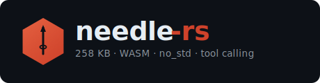

<div align="center">
  

  <br/><br/>

  <a href="https://github.com/geekgineer/needle-rs/actions/workflows/ci.yml"></a>
  <a href="https://crates.io/crates/needle-rs"></a>
  <a href="https://www.npmjs.com/package/needle-rs"></a>
  <a href="LICENSE"></a>
</div>

<br/>

A complete tool-calling AI model in 258 KB. needle-rs is a pure-Rust runtime for [Needle](https://github.com/cactus-compute/needle) (Cactus Compute, 2026) — a 26M-parameter encoder-decoder transformer that maps a natural-language query and a list of tools to structured JSON, in a single forward pass. Runs in the browser as WASM, on embedded hardware as a `no_std` library, or as a 533 KB static binary.

## Compared to alternatives

| | needle-rs | ONNX Runtime Web | llama.cpp WASM |
|---|:---:|:---:|:---:|
| Runtime WASM size | **258 KB** | ~3–8 MB | ~5 MB+ |
| Tool-calling model included | ✓ 26M params | bring your own | bring your own |
| Constrained JSON output | ✓ | partial¹ | ✓ GBNF grammars |
| `no_std` / embedded | ✓ | — | — |
| Browser | ✓ | ✓ | ✓ |
| General-purpose LLM | — | ✓ | ✓ |

¹ ONNX Runtime GenAI adds constrained decoding but the web variant currently requires building from source.

[Cactus](https://github.com/cactus-compute/cactus) targets iOS/Android/NPU. needle-rs is the browser and embedded story.

## Quick start

**Browser / Node.js**

```bash
npm install needle-rs
```

```js
import init, { NeedleWasm } from "needle-rs";
await init();

const engine = NeedleWasm.load(weights, vocab);
engine.run("Book a flight from London to JFK", tools);
// → {"name":"book_flight","arguments":{"origin":"London","destination":"JFK"}}
```

**Rust**

```bash
cargo add needle-infer
```

```rust
use needle_infer::NeedleEngine;

let engine = NeedleEngine::load("weights/needle.safetensors", "weights/vocab.txt")?;
let result = engine.run(query, tools_json);
println!("{}", result.text);
```

**Weights (22 MB)**

```bash
huggingface-cli download Abdalrahman/needle-rs-safetensors \
  needle.safetensors vocab.txt --local-dir weights/
```

## Full API

**JavaScript**

```js
engine.run(query, tools)                              // → string
engine.run_stream(query, tools, (id, piece) => {})    // fires per token → string
engine.run_batch([{ query, tools }, ...])             // → string[]
engine.encode_contrastive(text)                       // → Float32Array | null
engine.retrieve_tools(query, descriptionsJson, topK)  // → JSON string
```

**Rust**

```rust
engine.run(query, tools_json)
engine.run_stream(query, tools_json, |_id, piece| print!("{piece}"))
engine.run_batch(&[(q1, t1), (q2, t2)])
engine.encode_contrastive(text)            // → Option<Vec<f32>>
engine.retrieve_tools(query, descs, k)     // → Vec<(usize, f32)>
```

**C**

```c
#include "needle.h"

NeedleHandle h   = needle_load("needle.safetensors", "vocab.txt");
const char *out  = needle_run(h, query, tools_json);
printf("%s\n", out);
needle_free_str((char *)out);
needle_free(h);
```

Full header: [`crates/needle-c/include/needle.h`](crates/needle-c/include/needle.h)

## How it works

- **Encoder-decoder SAN**: encoder reads `query + tool definitions` once; decoder auto-regressively generates the tool-call JSON token by token
- **INT4 quantization**: attention weights nibble-packed with `group_size=32`; dequantized on-the-fly — no full f32 weight matrix is ever materialized
- **AVX2 / NEON SIMD**: runtime CPUID dispatch on x86\_64; NEON unconditional on aarch64; scalar fallback keeps the WASM build clean
- **Constrained decoding**: character-level trie over tool names and argument keys plus a three-state JSON machine; invalid logits are masked at every step — output is always syntactically valid JSON
- **OpenAI-compatible tools**: handles both flat `{"location": {...}}` and JSON Schema `{"type":"object","properties":{...}}` parameter formats
- **Parity**: 560 test vectors with exact token-ID match against the Python reference; 55 constrained-decoder unit tests

## Benchmarks

Measured on Intel i7-1185G7 (Tiger Lake), LPDDR4x, Linux, release build.

| | |
|---|---|
| Load + first inference | **283 ms** |
| INT4 matvec 512×512 (AVX2) | **83 µs · 3.2 Gelem/s** |

Binary sizes, stripped release:

| | |
|---|---|
| WASM module | **258 KB** |
| CLI binary | **533 KB** |
| C shared library | **557 KB** |
| Weights (INT4 SafeTensors) | **22 MB** |

Apple Silicon benchmark pending — NEON path is implemented. M-series numbers welcome.

## Acknowledgements

Needle is designed and trained by [Henry Ndubuaku](https://github.com/hndubuaku) and [Cactus Compute](https://github.com/cactus-compute), released under MIT. The model architecture, training code, and weights are entirely their work. needle-rs is a deployment layer for contexts their JAX implementation cannot reach.

## Citation

```bibtex
@software{needle2026,
  author  = {Ndubuaku, Henry and {Cactus Compute}},
  title   = {Needle: A 26M-Parameter Tool-Calling Transformer},
  year    = {2026},
  url     = {https://github.com/cactus-compute/needle},
  license = {MIT}
}

@software{needlers2026,
  author  = {Ibrahim, Abdalrahman},
  title   = {needle-rs: Pure-Rust WASM Runtime for Needle},
  year    = {2026},
  url     = {https://github.com/geekgineer/needle-rs},
  license = {MIT}
}
```

---

MIT — see [LICENSE](LICENSE). Model and weights by [Cactus Compute](https://github.com/cactus-compute), also MIT.
